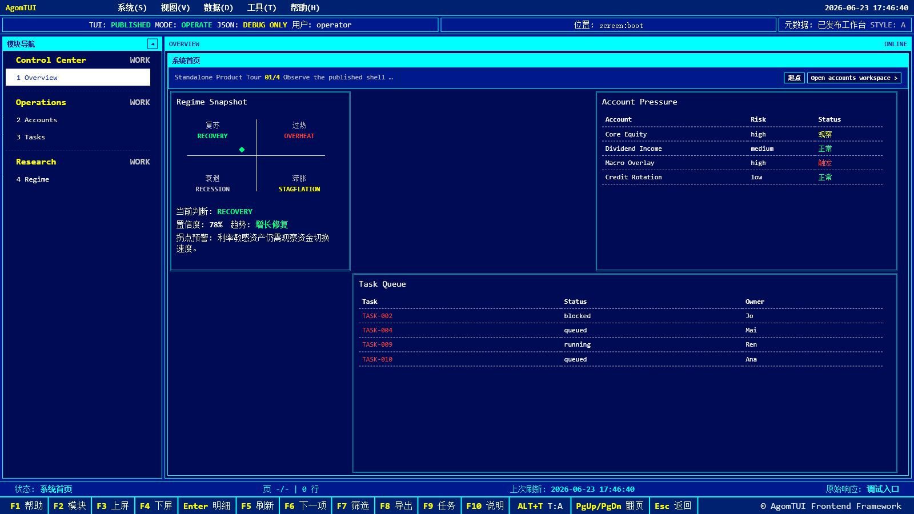
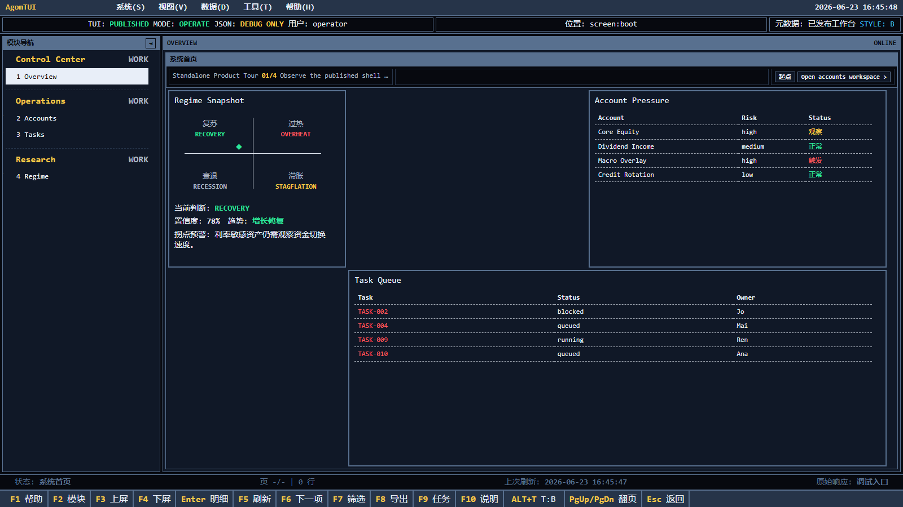
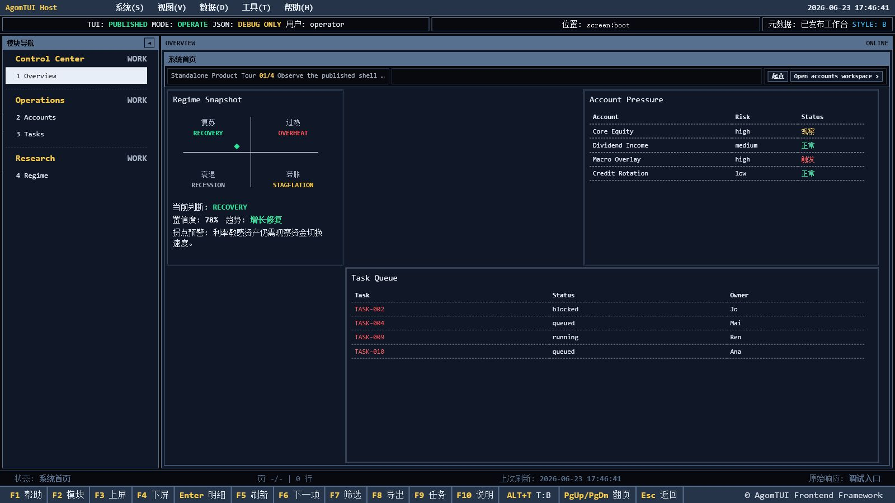

# AgomTUI

[中文说明](./README.zh-CN.md)

**把后端 API 和业务逻辑直接变成可用的前端操作台 TUI。**

Generate a usable TUI operations workbench directly from backend APIs and business logic, instead of hand-building the whole frontend console from scratch.

## The problem it solves

Most internal tools stall in the same place:

- the data API exists, but the usable operator UI does not
- every new tool reimplements tables, detail views, filters, pagination, and action forms
- risky actions need confirmation and traceability, but those rules are rebuilt screen by screen
- some teams want to launch it first as a standalone console, while others want to plug the same workbench into an existing Django or internal system

AgomTUI is for that gap. It gives you a reviewed runtime shell for operations-heavy tools, plus a metadata path that lets one workbench drive many screens instead of rebuilding each page by hand.

## Good fit

AgomTUI is a strong fit if you want to build:

- an internal operations console
- a risk-control or governance-heavy back-office tool
- a host-mounted TUI surface inside Django or another web app
- a reusable shell for teams that already have APIs but not a consistent operator experience

## Why it feels useful fast

With the demo alone, a user can immediately see:

- what the standalone workbench experience looks like
- how the same runtime can mount back into a host project
- how metadata, not ad hoc page code, drives navigation and action surfaces

## Demo

### Overview workspace



### Standalone runtime workbench



### Host-mounted runtime



## What you get

- a terminal-style runtime shell that already has navigation, inspector, filters, paging, action forms, modal confirmation, and raw-response debugging
- a metadata contract for defining screens and actions without rewriting the shell
- a path for turning code-owned evidence into published runtime metadata
- a host-adapter model, so the same runtime can run standalone or under another application shell

## What is in this repo

- `packages/agomtui-core/`: schema, validator, runtime contracts, and generic server-side runtime helpers
- `packages/agomtui-runtime/`: extracted browser shell assets and renderer reference
- `packages/agomtui-compiler/`: compile-time collector / AI synthesizer / validator / publisher skeleton
- `demo/`: runnable standalone demo, compiler walkthrough, integration demo, and migration pages
- `adapters/django/`: notes for the first host adapter
- `examples/metadata/`: minimal metadata fixtures
- `docs/`: extraction boundary, migration, and architecture notes

## For builders

If you are evaluating whether this saves real work, the practical answer is:

- you keep your APIs
- you stop rebuilding the same operator UI primitives for every tool
- you get one shell that can serve many internal workflows
- you can start standalone and later mount into a host app without throwing the runtime away

## Reusable now

- metadata schema (`tui-metadata.v3`)
- metadata validation and compaction
- generic server-side runtime helpers:
  - view-model inference
  - confirmation contract
  - missing-fields contract
  - password-challenge detection
  - runtime metadata normalization hooks
- runtime shell layout, keyboard model, theme tokens
- generic renderers: dashboard, datagrid, detail, and message views
- generic action framework: task grouping, confirmation, row-fill, filter, pager, inspector, modal, raw drawer
- compiler boundaries for evidence-driven metadata synthesis
- generic repository / action-executor contracts

## Still host-specific

- business screen definitions and workflow ordering
- published business metadata graphs
- auth and login flow
- DB publish registry and audit storage
- internal API execution adapter
- host vocabulary and view-model translation
- compile-time harvesting heuristics

## Quick start

### 1. Run the demo stack

From the repository root:

```powershell
python demo\run_demo_stack.py
```

Open:

- `http://localhost:8020/` for the product overview
- `http://localhost:8020/standalone/` for the standalone runtime
- `http://localhost:8020/compiler/` for the compiler walkthrough
- `http://localhost:8020/integration/` for the host integration contract demo
- `http://localhost:8020/migration/` for the migration checklist
- `http://localhost:8030/` for the Django host page
- `http://localhost:8030/tui/` for the Django-mounted runtime

If you only want the standalone surface:

```powershell
python demo\standalone_server.py
```

If you want the Django host separately:

```powershell
python demo\django_host\manage.py runserver 127.0.0.1:8030 --noreload
```

### 2. Run tests

Compiler tests:

```powershell
$env:PYTHONPATH='D:\githv\AgomTUI\packages\agomtui-core\src;D:\githv\AgomTUI\packages\agomtui-compiler\src'
python -m unittest discover packages\agomtui-compiler\tests
```

Core runtime tests:

```powershell
$env:PYTHONPATH='D:\githv\AgomTUI\packages\agomtui-core\src'
python -m unittest discover packages\agomtui-core\tests
```

Django host tests:

```powershell
python demo\django_host\manage.py test django_host
```

## Product boundary

AgomTUI is not a Django template split. The durable product boundary is:

1. schema-first metadata core
2. compile-time metadata generator / promotion pipeline
3. runtime TUI shell and host adapters

Suggested package line:

- `agomtui-core`: schema, validator, runtime contracts
- `agomtui-runtime`: browser shell and renderer
- `agomtui-compiler`: evidence collectors and publish pipeline
- `agomtui-adapters-*`: host integrations such as Django / FastAPI / OpenAPI-only

## AI skill path

The intended generation path is:

1. collectors read code-owned evidence
2. `agomtui-compiler skill-request` emits a schema-constrained prompt payload
3. an external AI skill returns one `candidate_payload`
4. `agomtui-compiler compile-skill-result` validates, compacts, and publishes the approved artifact

The extracted skill should target host-agnostic runtime metadata first. It should not assume one product's page splits, workflow ordering, or business prose unless those structures are explicitly present in the evidence bundle.

## Start here

- read `docs/product-split.md` for the extraction boundary
- read `docs/compiler-architecture.md` for the compile-time architecture
- open `packages/agomtui-runtime/reference/tui_workbench.reference.html` for the current shell reference
